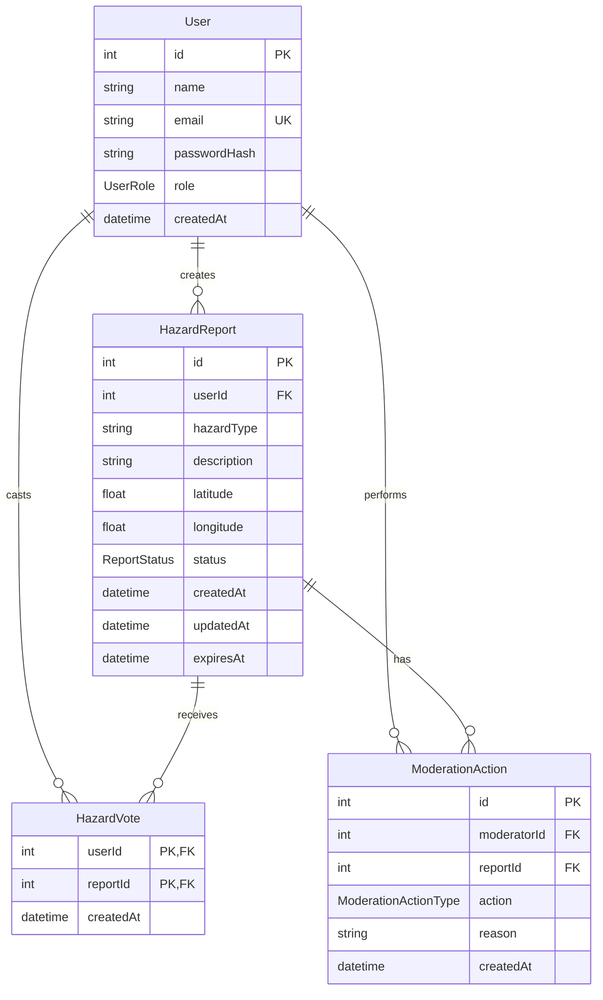

# RouteShield ER Diagram

```mermaid
erDiagram
    User ||--o{ HazardReport : creates
    User ||--o{ HazardVote : casts
    HazardReport ||--o{ HazardVote : receives
    User ||--o{ ModerationAction : performs
    HazardReport ||--o{ ModerationAction : has

    User {
        int id PK
        string name
        string email UK
        string passwordHash
        UserRole role
        datetime createdAt
    }

    HazardReport {
        int id PK
        int userId FK
        string hazardType
        string description
        float latitude
        float longitude
        ReportStatus status
        datetime createdAt
        datetime updatedAt
        datetime expiresAt
    }

    HazardVote {
        int userId PK, FK
        int reportId PK, FK
        datetime createdAt
    }

    ModerationAction {
        int id PK
        int moderatorId FK
        int reportId FK
        ModerationActionType action
        string reason
        datetime createdAt
    }
```

## Constraints
- User.email is UNIQUE
- HazardVote has composite primary key (userId, reportId)
- Foreign keys use ON DELETE RESTRICT and ON UPDATE CASCADE
